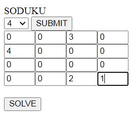
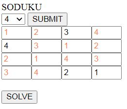

# SUDOKU_GUI_SOLVER
This Project implements the back track algorithm to solve the sudoku puzzle and also presents a front end graphical user interface 

## User interface 
This app allows the user to create a blank sudoku grid of different grid sizes based on the requirement .
User can select the grid size from the drop down menu and when the submit button is pressed the grid is generated dynamically

Once the grid is generated the user can give the input values to their respective cells like the image below

After gving the input the user can press the solve button and the cells containing zero will be filled up by the proper numbers.

## Back Track algorithm
The front end javascript file implements the backtrack algorithm to solve the sudoku puzzle reading the values from the input cells which user provides .
